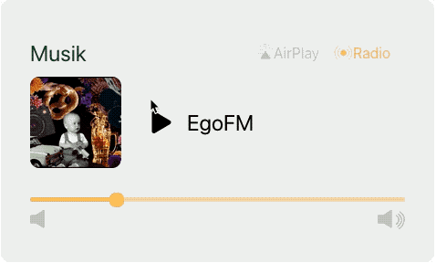

# herbiOS

herbiOS is a software to control different electric parts of a van in a modern and smart way.

> The project is under heavy development and the focus is currently on our own hardware implementation in our van. The documentation is also not quite good yet. If you want to build herbiOS for your own van feel free to contact me to get some help. Together we can improve the documentation and missing parts a lot.

## Features

### Lights

Control up to five light circuits.

### Audio

Play our music in the van via AirPlay, Bluetooth or start a spotify playlist or run a classic radio station.

### Heater

Set the power of the heater manually or set a temperature and the van is holding the temperature with the heater and fans.

## Documentation

Read the [Documentation](./documentation/index.md) to get all information of the project and code.

## Licence

Read the [LICENSE](LICENSE.md) documentation for more information.

## Contributing

Please read [CONTRIBUTING.md](CONTRIBUTING.md) to learn about contributing to this project.