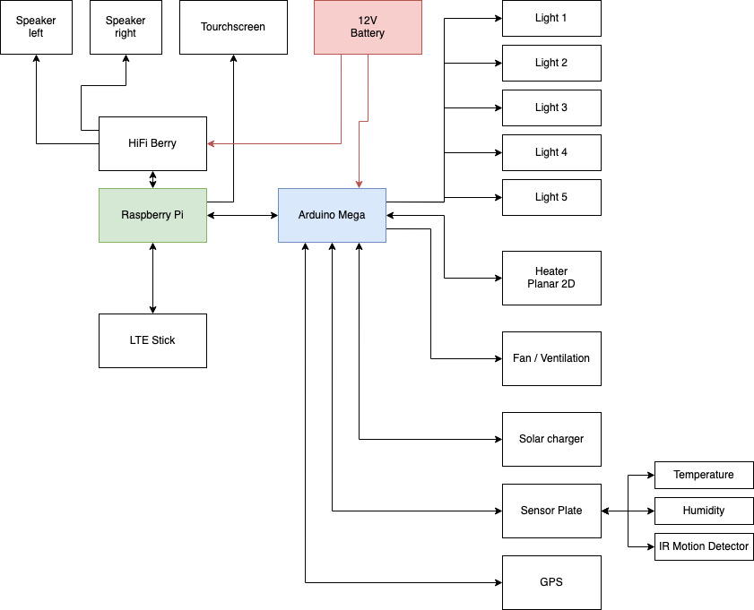

# Hardware Setup

## General

The following graphic shows how the hardware is wired up to use herbiOS.



The concept splits two main tasks in two different hardware parts. One task is to talk to each sensor and actor and the other takes care of the complete and bigger software programs like the main logic, user interface, multimedia and offline maps.

## Arduino Mega

The Arduino (blue box in graphic above) tackles the task to talk to each sensor and actor in the van. The firmware provides a simple Command-Line like unified interaction ability over a serial connection. 

Commands looks like:

````
setLight -light 1 -level 255
getPosition
heater -do heat9
heater -do status
````

There are a couple of advantages to separate this into an own component. One is to minimize complications on the raspberry pi GPIO pins with other modules and extend the limited pins. The biggest one is that other makers can just use the arduino to include this part in their own project or setup. 

In the project structure the arduino firmware can be found in the [Sensorer](../sensorer/Readme.md) folder. Just a name that describes the task hopefully at its best.

> A wiring of the currently supported actors and sensors will follow soon

## Raspberry Pi

The RaspberryPi is a small mini computer. It's task is to manage the complicated and advanced stuff. It runs the [API](../../api/README.md) the brain from herbiOS and the [User Interface](../../ui/README.md) that allows us to interact with the system. It also provides a WiFi access point and when you installed an LTE Stick it provides you also with internet.
